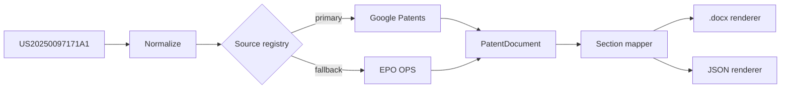

 

I build systems where a language model does the judgment and automation does the work.
Document pipelines, email agents, RPA robots — designed to run end to end with no human in the loop.

Currently a COOP intern at **Saudi Aramco**, Planning &amp; Performance Management.

 

### Education

**B.Sc. Artificial Intelligence** — Imam Abdulrahman Bin Faisal Univerisy
`Machine Learning` · `Robotics` · `Information Security` · `Data Structures` · `Databases`

 

### Work

  

**Patent Retriever** — enter a patent number, get back a formatted legal filing.
Scrapes and normalizes the full document, then renders a `.docx` that matches an exact
attorney-filing spec down to the custom Word list numbering. Pluggable source layer,
CLI and web interface, 147 tests.

**AI Email Assistant** — an autonomous mail agent. Reads incoming email and its
attachments together, extracts action items, deadlines and meetings, then writes
Outlook tasks and calendar events. Uses vector embeddings and cosine similarity to
suppress duplicate tasks, files attachments into a categorized library with
AI-written summaries, and emails a generated weekly report.

 

### Stack

`Python` `Flask` `pytest` `SQL` `Git` `UiPath` `Gemini API` `Embeddings` `python-docx`

 

<picture>
  <source media="(prefers-color-scheme: dark)" srcset="https://github-readme-stats.vercel.app/api?username=zunecs&show_icons=true&hide_border=true&bg_color=00000000&title_color=E86A33&text_color=8B949E&icon_color=E86A33" />
  
</picture>

  

<a href="www.linkedin.com/in/abdulrahman-alaamri">LinkedIn</a> &nbsp;·&nbsp; <a href="mailto:2240002427@iau.edu.sa">Email</a>
