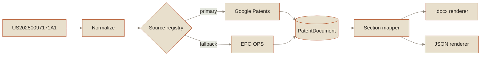
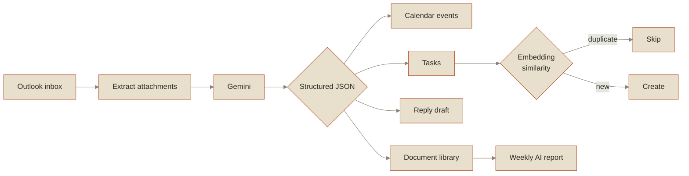

  

<h3 align="center">I · Provenance</h3>

  
  
    
  
  

<h3 align="center">II · The Record</h3>

<h3 align="center">III · Plates</h3>

 

> **PLATE I — Patent Retriever**
> A patent number in, a filing-ready document out. Scrapes and normalizes the full
> patent, then renders a `.docx` matching an exact attorney-filing spec down to the
> custom Word list numbering. Pluggable source layer, CLI and web interface, 147 tests.

 

> **PLATE II — AI Email Assistant**
> An autonomous mail agent. Reads each email together with its attachments, extracts
> what the sender actually wants, and writes the resulting tasks and calendar entries.
> Suppresses duplicates by vector similarity rather than string matching.

<h3 align="center">IV · Instruments</h3>

  

  
  

<h3 align="center">V · Correspondence</h3>

  
  

