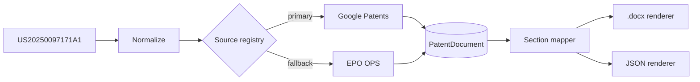
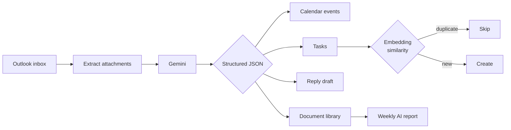

  

 

  
  
  

 

<h3 align="center">Contribution activity</h3>

 

<h3 align="center">Work</h3>

 

**Patent Retriever** — a patent number in, a filing-ready document out. Scrapes and
normalizes the full patent, then renders a `.docx` matching an exact attorney-filing
spec down to custom Word list numbering. Pluggable sources, CLI + web UI, 147 tests.

 

**AI Email Assistant** — an autonomous mail agent. Reads each email together with its
attachments, extracts what the sender actually wants, and writes the resulting tasks and
calendar entries. Suppresses duplicates using vector similarity rather than string matching.

 

<h3 align="center">Stack</h3>

  

 

  
  

 

  
  

